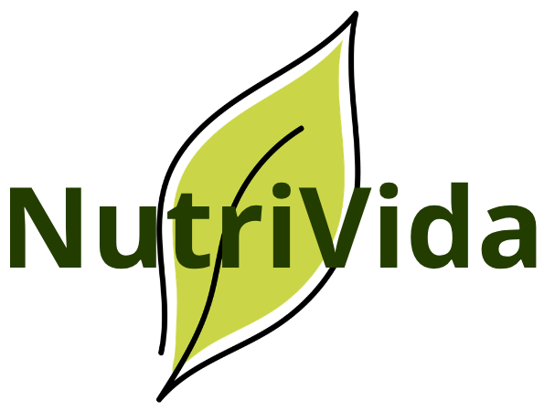

<div align="center">

  

  # 🥗 NutriVida - Clínica Nutricional
  **Plataforma Web Integral de Bienestar, Salud y Asesoría Nutricional**

  [](https://developer.mozilla.org/es/docs/Web/HTML)
  [](https://developer.mozilla.org/es/docs/Web/CSS)
  [](https://developer.mozilla.org/es/docs/Web/JavaScript)
  [](https://en.wikipedia.org/wiki/Responsive_web_design)
  [](#)

</div>

---

## 📖 Acerca del Proyecto

**NutriVida** es una solución web integral desarrollada para una clínica nutricional moderna. Su propósito es brindar a los usuarios una experiencia digital cálida, intuitiva y profesional para descubrir planes nutricionales personalizados, agendar consultas clínicas, informarse sobre políticas de salud preventiva y gestionar su acceso mediante un sistema de registro y autenticación validado.

La estética del proyecto combina **precisión clínica con bienestar orgánico**, utilizando tonos verdes bosque, neutros cálidos y tipografía contemporánea.

---

## ✨ Características y Funcionalidades Actuales

### 🏠 1. Página de Inicio (`index.html`)
- **Barra de navegación fija (*sticky header*)**: Con logotipo, enlaces principales y accesos directos a Login y Registro.
- **Sección de Bienvenida**: Introducción a los valores y enfoque integral de la clínica.
- **Pie de página corporativo (*Footer*)**: Estructura a 3 columnas con enlaces de contacto, legales, líneas divisorias punteadas y copyright institucional.

### 📋 2. Catálogo de Servicios y Productos (`servicios.html`)
- **Filtro dinámico por categoría**: Filtrado en tiempo real sin recarga de página (*Todos, Planes nutricionales, Consultas, Pack de Seguimiento*).
- **Tarjetas de Servicio (*Cards*) con diseño enriquecido**:
  - Imágenes fotográficas en alta resolución con capa de degradado verde/oscuro para máxima legibilidad.
  - Etiquetas descriptivas (*Plan Mensual, Consulta Presencial, Pack Seguimiento*).
  - Listado de prestaciones y beneficios con viñetas de verificación (`✓`).
  - Precios claros en CLP y botones de acción redondeados estilo píldora (*Agendar Plan / Consulta &rarr;*).
  - Micro-interacciones de elevación (`translateY`) y sombras suaves al pasar el cursor.

### 🔐 3. Inicio de Sesión (`login.html`)
- Tarjeta de autenticación minimalista y accesible.
- **Validaciones en tiempo real y al envío (`validacionLogin.js`)**:
  - Comprobación de campos obligatorios.
  - Restricción de dominios de correo institucional y personal permitidos:
    - `@duocuc.cl`
    - `@profesor.duoc.cl`
    - `@gmail.com`
  - Longitud mínima de contraseña (6 caracteres).
  - Mensajes de error interactivos y alertas animadas de éxito/error.
  - Simulación de sesión guardada en `sessionStorage`.

### 📝 4. Registro de Pacientes (`registro.html`)
- Formulario adaptado a ficha clínica nutricional con diseño en cuadrícula de 2 columnas:
  - **Nombre Completo**: Validación de texto y longitud mínima.
  - **RUT / Identificación**: Validación de formato.
  - **Fecha de Nacimiento**: Selector de fecha con validación temporal.
  - **Correo Electrónico**: Validación de dominios autorizados (`@duocuc.cl`, `@profesor.duoc.cl`, `@gmail.com`).
  - **Teléfono (opcional)**: Validación de formato telefónico.
  - **Objetivo Nutricional Principal**: Selector con opciones especializadas (*Pérdida de Grasa, Masa Muscular, Rendimiento Deportivo, Salud Digestiva, Nutrición Vegana/Vegetariana, Control de Patologías*).
  - **Contraseñas**: Validación de robustez mínima y coincidencia entre contraseña y confirmación.
  - **Términos y Privacidad**: Casilla de verificación obligatoria vinculada a las páginas legales.
- Script de validación dedicado (`validacionRegistro.js`) con retroalimentación inmediata.

### ⚖️ 5. Políticas y Legalidad (`privacidad.html` y `terminos.html`)
- Documentación legal transparente orientada a la protección de datos sensibles de salud de los pacientes.

---

## 🎨 Sistema de Diseño y Paleta de Colores

El proyecto cuenta con un sistema de tokens CSS centralizado en variables globales (`:root`):

| Color | Código Hex | Variable CSS | Uso Principal |
| :--- | :--- | :--- | :--- |
| **Verde Bosque** | `#2D5A27` | `--color-primary` | Botones principales, títulos, enlaces activos |
| **Verde Oscuro Hover** | `#21441c` | `--color-primary-hover` | Estados interactivos hover |
| **Marrón Tierra** | `#6F4E37` | `--color-secondary` | Acentos secundarios y enlaces de login |
| **Verde Salvia** | `#9CAF88` | `--color-tertiary` | Etiquetas, checkmarks (`✓`) e indicadores |
| **Fondo Neutro Cálido** | `#F9F8F6` | `--color-neutral` | Fondo general de la aplicación |
| **Fondo Footer** | `#EAEBE6` | `--color-footer-bg` | Fondo del pie de página |
| **Texto Principal** | `#1F251E` | `--color-text-main` | Tipografía principal de alta legibilidad |
| **Texto Secundario** | `#555E53` | `--color-text-muted` | Subtítulos y descripciones |

**Tipografía Principal:** [`Manrope`](https://fonts.google.com/specimen/Manrope) (Google Fonts) para una lectura clara, moderna y geométrica.

---

## 📁 Estructura del Proyecto

```text
Proyecto-NutriVida/
├── assets/
│   └── img/
│       ├── consulta-nutricional.jpg    # Imagen de tarjeta de consulta
│       ├── logo-login.jpg              # Logotipo alternativo
│       ├── logo-nutrivida.png          # Logotipo oficial
│       ├── pack-seguimiento.jpg        # Imagen de tarjeta de pack
│       └── plan-integral-mensual.jpg   # Imagen de tarjeta de plan
├── css/
│   ├── stylefuentes.css                # Configuración e importación de fuentes
│   ├── styleindex.css                  # Hoja de estilos global y layout
│   └── styleRegistroLogin.css          # Estilos de formularios de autenticación
├── js/
│   ├── main.js                         # Filtrado dinámico de servicios
│   ├── validacionLogin.js              # Validación para login.html
│   └── validacionRegistro.js           # Validación para registro.html
├── index.html                          # Página principal de inicio
├── login.html                          # Portal de inicio de sesión
├── privacidad.html                     # Aviso de privacidad y datos
├── registro.html                       # Formulario de registro de usuario
├── servicios.html                      # Catálogo y filtrado de servicios
├── terminos.html                       # Términos y condiciones del servicio
└── README.md                           # Documentación general del proyecto
```

---

## 🚀 Puesta en Marcha (Instalación Local)

Este proyecto está construido con tecnologías web estándar (HTML5, CSS3 y Vanilla JavaScript), por lo que **no requiere instalación de dependencias externas ni compiladores**:

1. **Clonar el repositorio**:
   ```bash
   git clone https://github.com/Liz-Elizabeth/Proyecto-NutriVida.git
   ```

2. **Acceder a la carpeta del proyecto**:
   ```bash
   cd Proyecto-NutriVida
   ```

3. **Abrir la aplicación**:
   - Puedes abrir directamente el archivo `index.html` en tu navegador web preferido (doble clic o arrastrar al navegador).
   - O utilizar la extensión **Live Server** de Visual Studio Code para recarga en tiempo real.
   - O iniciar un servidor estático rápido:
     ```bash
     npx serve .
     # o con Python:
     python -m http.server 8000
     ```

---

## 🛡️ Reglas de Validación Implementadas

- **Restricción estricta de dominios**: Únicamente se aceptan correos pertenecientes a:
  - `@duocuc.cl` (Estudiantes / Institucional Duoc UC)
  - `@profesor.duoc.cl` (Docentes Duoc UC)
  - `@gmail.com` (Cuentas personales autorizadas)
- **Seguridad de contraseñas**: Mínimo 6 caracteres requeridos. En el registro se verifica la igualdad exacta entre ambos campos.
- **RUT Chileno / Identificación**: Requiere formato válido mínimo de 7 caracteres.
- **Consentimiento informado**: Verificación obligatoria de aceptación de términos antes de enviar el formulario.

---

## 👥 Equipo de Desarrollo

Proyecto desarrollado para la evaluación técnica Full Stack por el equipo de **NutriVida Clínica Nutricional**.

---

<div align="center">
  <sub>© 2026 NutriVida Clínica Nutricional. Todos los derechos reservados.</sub>
</div>
